# Detección de Melanomas

Clasificación de lesiones dermatoscópicas en **benignas** o **melanoma**. Para
hacerlo se prueban y se comparan tres enfoques: un modelo clásico que trabaja con
descriptores de la forma de la lesión y dos redes convolucionales que reciben la
imagen de distinta manera.

## Prueba la aplicación

Desplegada en Hugging Face: **https://huggingface.co/spaces/Martinagg/DermaScan**

Subes una foto del lunar y devuelve la probabilidad de melanoma.

---

## 1. Datos

Fotos dermatoscópicas etiquetadas como benignas (`Benign`) o melanoma
(`Malignant`).

| Conjunto | Imágenes | Origen | Uso |
|---|---|---|---|
| Entrenamiento | ~11.900 | descarga en `config/01_dowload_data.ipynb` | ajuste de los modelos |
| Test | 2.000 (1.000 por clase) | misma fuente | evaluación; también sirve de validación durante el entrenamiento |
| Externo | 45 (22 benignas / 23 malignas) | archivo público **ISIC** | prueba de generalización a otra fuente |

Las carpetas `data/` y `models/` no se suben al repositorio.

---

## 2. Preprocesado

Antes de entrenar, cada imagen pasa por un pipeline de limpieza
(`src/preprocessing/`, se ejecuta con `python main.py`) cuyo objetivo es quedarse
solo con la lesión.

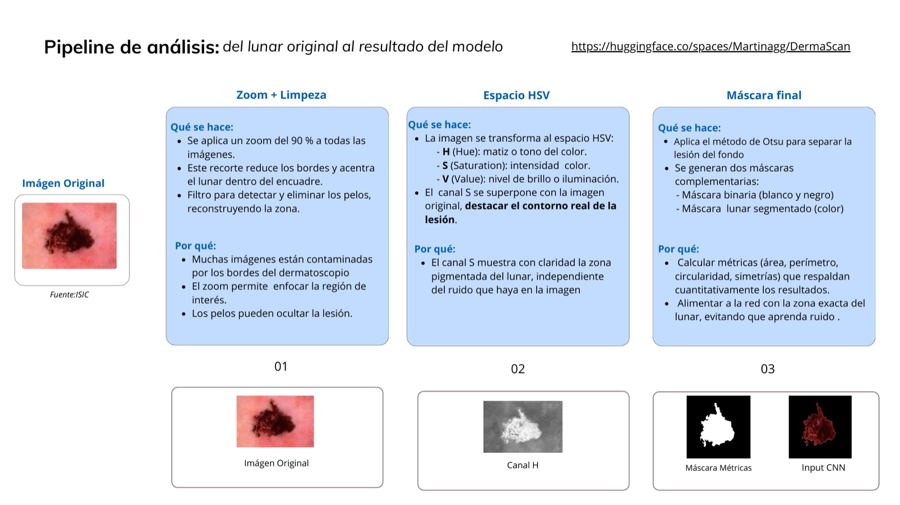

| Paso | Qué hace | Por qué |
|---|---|---|
| Zoom y depilado | recorte central y borrado de los pelos (black-hat + `inpaint`) | acerca la lesión y quita el vello y el borde del dermatoscopio |
| Canal de saturación | se trabaja sobre el canal S del espacio HSV | la zona pigmentada resalta ahí aunque haya sombras o brillos |
| Segmentación | umbral de Otsu para separar lesión y fondo | máscara limpia de la lesión |

El resultado son tres versiones de cada imagen, una para cada modelo:

| Carpeta | Contenido | La usa |
|---|---|---|
| `zoomed/` | imagen RGB recortada | ZoomNet |
| `masks/` | máscara binaria de la lesión | Random Forest |
| `lesions/` | lesión segmentada sobre fondo negro | SimpleNet |

A partir de la máscara se calculan además cinco descriptores de la forma de la
lesión, inspirados en la regla ABCD, que son la entrada del Random Forest:

| Descriptor | Definición |
|---|---|
| Área | píxeles de la lesión |
| Perímetro | longitud del contorno |
| Circularidad | `4·π·Área / Perímetro²` (1 = círculo) |
| Simetría vertical / horizontal | solapamiento de la máscara con su reflejo respecto a cada eje |

---

## 3. Modelos

| Modelo | Entrada | Accuracy test | Recall melanoma |
|---|---|---|---|
| Random Forest | 5 descriptores de forma | 0.72 | 0.65 |
| **ZoomNet** | imagen RGB con zoom | **0.89** | 0.86 |
| **SimpleNet** | lesión segmentada | 0.81 | 0.70 |

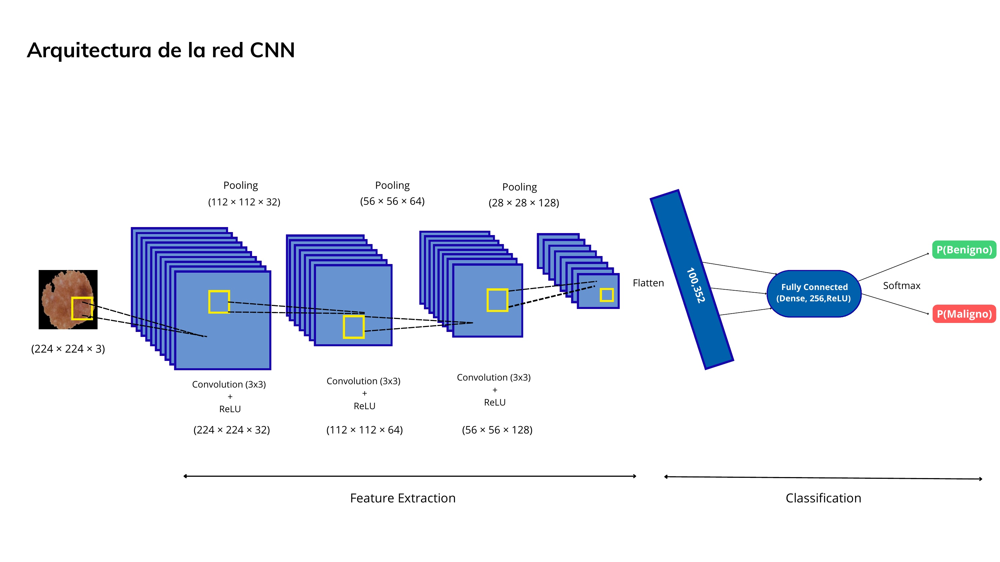

### 3.1. Random Forest (`notebooks/00_rf_metrics.ipynb`)

Un modelo clásico que usa solo los cinco descriptores de forma, sin ver la
imagen. Sirve de referencia y es fácil de interpretar. En
`exploration/00_features.ipynb` se ve que las lesiones malignas tienden a ser
menos redondas y menos simétricas, aunque con bastante solapamiento.

| Importancia de variables | Matriz de confusión (test) |
|---|---|
| 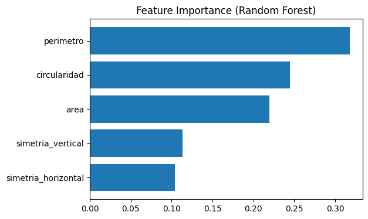 | 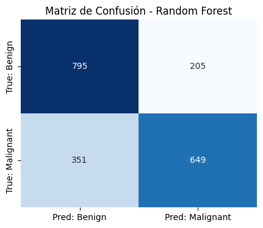 |

Acierta el 0.72. Pesan sobre todo el perímetro, la circularidad y el área. La
forma sola no basta: se le escapa uno de cada tres melanomas.

### 3.2. ZoomNet (`notebooks/01_rgb_grad_cam.ipynb`)

Una red convolucional que recibe la imagen completa del lunar, con la piel de
alrededor.

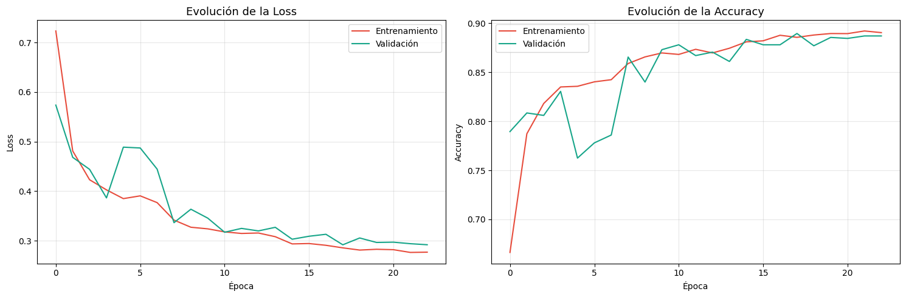

Entrenamiento y validación van juntas, sin sobreajuste; AUC 0.958.

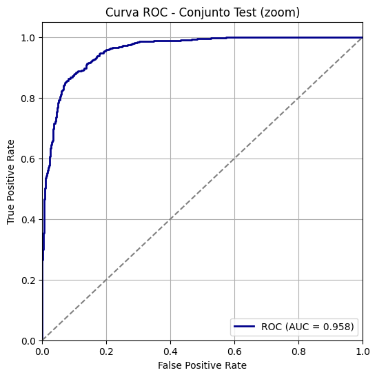

Es la que mejor clasifica el test interno (0.89), pero esa ventaja se pierde con
imágenes de otra fuente (sección 4). Los mapas de Grad-CAM muestran que se fija
en el borde y el interior de la lesión, no en el fondo:

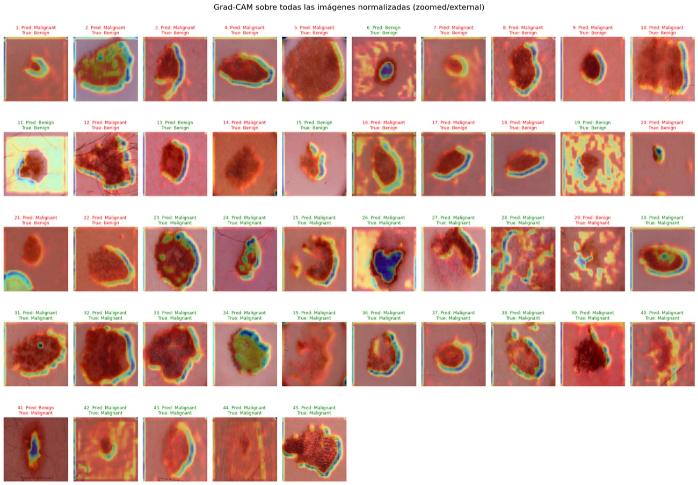

### 3.3. SimpleNet (`notebooks/02_simpleNet.ipynb`)

Una red más ligera que recibe solo la lesión ya recortada, sin la piel de
alrededor.

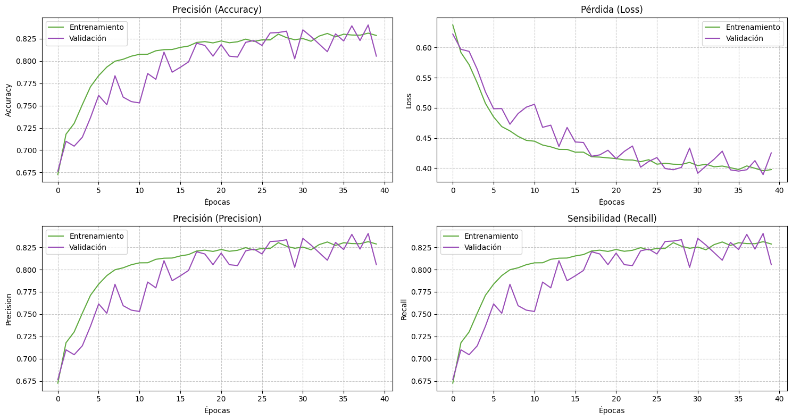

En el test interno alcanza 0.81, algo menos que ZoomNet, pero con curvas muy
estables. El notebook incluye también su curva ROC.

---

## 4. Evaluación externa (ISIC)

Para comprobar si las redes han aprendido algo que sirva más allá del conjunto de
entrenamiento, se prueban con 45 imágenes del archivo ISIC, tomadas con otros
equipos y en otras condiciones.

| Modelo | Accuracy | Recall melanoma | Recall benigno |
|---|---|---|---|
| ZoomNet | 0.58 | 0.91 (21/23) | **0.23 (5/22)** |
| SimpleNet | **0.71** | 0.83 (19/23) | 0.59 (13/22) |

| ZoomNet (externo) | SimpleNet (externo) |
|---|---|
| 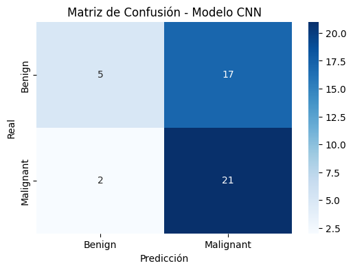 | 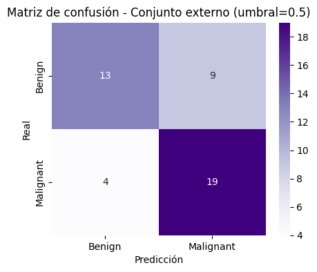 |

Aquí ZoomNet cae hasta 0.58 y se vuelve muy sesgada hacia "maligno": solo acierta
5 de las 22 lesiones benignas. Al haberse entrenado sobre la imagen completa, ha
acabado fijándose también en rasgos propios de la fuente original. SimpleNet, que
solo ve la lesión recortada, se comporta de forma mucho más equilibrada y
mantiene un 0.71.

Son solo 45 imágenes, así que los porcentajes concretos hay que tomarlos con
cautela, pero la caída de ZoomNet y su sesgo hacia una clase se ven con claridad.

---

## 5. Modelo elegido: SimpleNet

SimpleNet es el modelo que se ha llevado a la demo, por tres motivos:

- Generaliza mejor a la fuente externa (0.71 frente a 0.58) sin decantarse
  siempre por la misma clase.
- Entrena de forma estable, sin sobreajuste.
- Es ligero, lo que facilita usarlo en la demo y en el dispositivo futuro.

Random Forest y ZoomNet se mantienen en el repositorio porque la comparación es
parte del resultado: dejan claro que la forma de la lesión por sí sola no basta y
que un buen número en el test interno no garantiza que el modelo funcione con
datos nuevos.

---

## 6. Estructura del repositorio

```
config/              comprobación del entorno y descarga de los datos
src/preprocessing/   zoom, depilado, segmentación y cálculo de descriptores
main.py              lanza el preprocesado sobre una carpeta de imágenes
exploration/         análisis de los descriptores de forma por clase
notebooks/
  00_rf_metrics.ipynb     Random Forest sobre los descriptores
  01_rgb_grad_cam.ipynb   ZoomNet + Grad-CAM
  02_simpleNet.ipynb      SimpleNet
reports/             caso de uso clínico y presentación
docs/img/            figuras de este README
```

---

## 7. Uso

```bash
pip install -r requirements.txt

# 1. descargar los datos: ejecutar config/01_dowload_data.ipynb

# 2. generar zoomed/, masks/, lesions/ y el CSV de descriptores
python main.py

# 3. entrenar y evaluar: ejecutar los notebooks en orden
```

---

## 8. Trabajo futuro

Dispositivo portátil basado en Raspberry Pi (cámara y pantalla) que captura la
lesión, estima la probabilidad de melanoma y envía el resultado a una plataforma
en la nube para el seguimiento clínico.

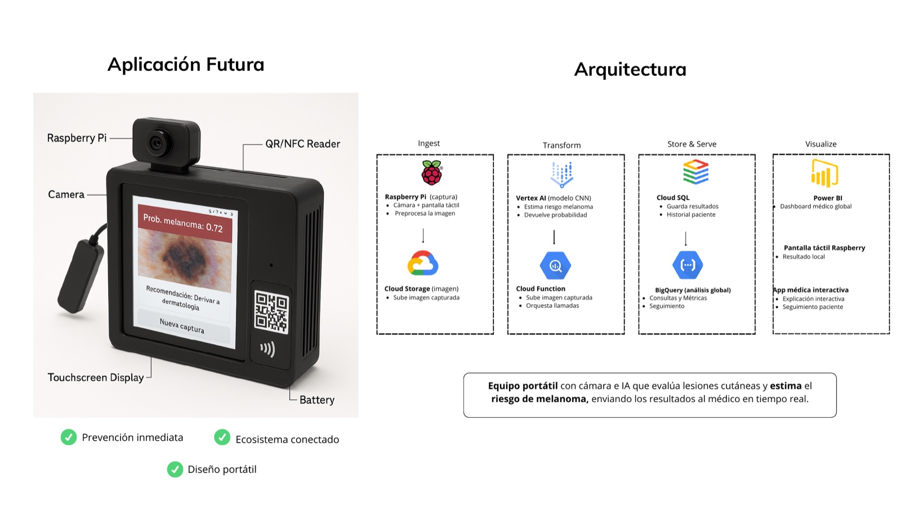
